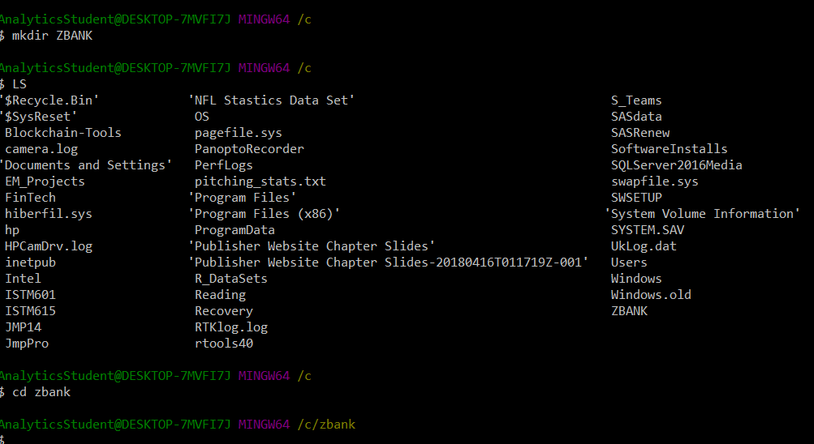
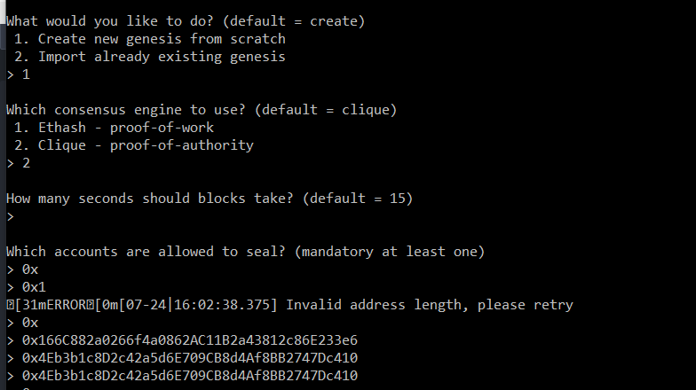
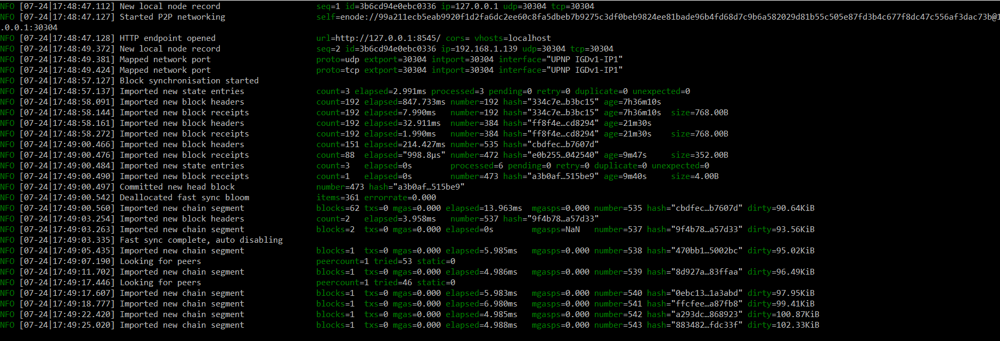
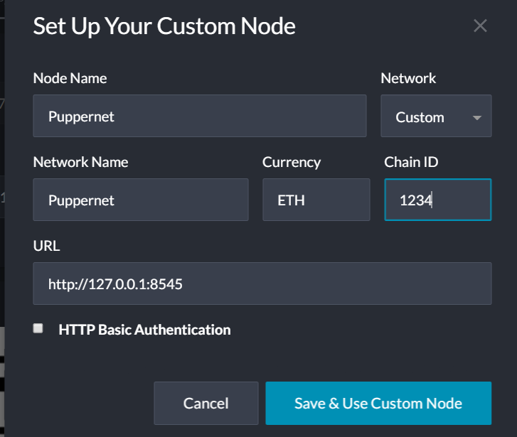

# Proof_of_Authority_Chain
Instructions for setting up a POA block chain
Step 1: Create the ZBank Directory

Step 2: Create the Genesis Block

Step 3: Generate the POA account transaction Nodes, Public and Secret keys

Step 4: Start the private Ethereum instance

